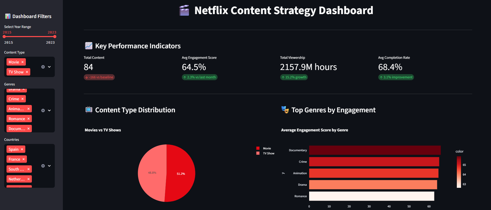

# 🎬 Netflix Content Strategy Dashboard

An interactive data analytics dashboard built with Streamlit that analyzes Netflix content performance, viewer engagement patterns, and strategic insights for content decision-making.

[](https://rh4t8mtzebqmffss7nthkp.streamlit.app/)

## 📷 Dashboard Preview




## 📊 Project Overview

This dashboard demonstrates advanced data analysis and visualization skills by providing actionable insights into Netflix's content strategy through:

- **Content Performance Analysis**: Engagement scores, completion rates, and viewership patterns
- **Geographic Market Analysis**: Regional content preferences and performance metrics  
- **Temporal Strategy Insights**: Optimal release timing and seasonal trends
- **Genre & Type Analysis**: Content category performance and ROI indicators

## 🚀 Key Features

### Interactive Visualizations
- Dynamic filtering by year, genre, country, and content type
- Real-time metric calculations and KPI tracking
- Correlation analysis between IMDB scores and engagement
- Geographic performance mapping and trends

### Business Intelligence Capabilities
- Content strategy recommendations based on data patterns
- Release timing optimization insights
- Market expansion opportunity identification
- Performance benchmarking across different dimensions

### Technical Highlights
- **Streamlit** framework for responsive web application
- **Plotly** for interactive charts and visualizations
- **Pandas** for efficient data manipulation and analysis
- Clean, modular code structure following best practices

## 🛠️ Installation & Setup

### Local Development
```bash
# Clone the repository
git clone https://github.com/yourusername/netflix-content-dashboard.git
cd netflix-content-dashboard

# Install dependencies
pip install -r requirements.txt

# Run the application
streamlit run app.py
```

## 📁 Project Structure

```
netflix-content-dashboard/
├── app.py                     # Main Streamlit application
├── netflix_content_data.csv   # Sample dataset (500 content titles)
├── requirements.txt           # Python dependencies
├── .gitignore                # Git ignore rules
├── README.md                 # Project documentation
└── LICENSE                   # MIT License
```

## 📈 Dashboard Sections

### 1. Key Performance Indicators (KPIs)
- Total content count with baseline comparison
- Average engagement score trending
- Total viewership hours with growth metrics
- Average completion rate improvements

### 2. Content Analysis
- Content type distribution (Movies vs TV Shows)
- Genre performance rankings by engagement
- Performance correlation analysis
- Release year trend analysis

### 3. Geographic Intelligence
- Content production by country
- Regional performance metrics
- Market opportunity identification
- Cultural preference insights

### 4. Strategic Recommendations
- Data-driven content strategy suggestions
- Optimal release timing recommendations
- Genre investment priorities
- Market expansion opportunities

## 🎯 Business Value

This dashboard addresses key business questions:

1. **Content Strategy**: Which genres and content types drive highest engagement?
2. **Market Analysis**: What are the best-performing geographic markets?
3. **Release Optimization**: When is the optimal time to release content?
4. **ROI Analysis**: Which content investments provide best returns?
5. **Growth Opportunities**: Where should Netflix expand content production?

## 📊 Data Insights

The analysis reveals several strategic insights:

- **Genre Performance**: Drama and Crime content show highest engagement scores
- **Geographic Trends**: English-speaking markets dominate, but local content performs well regionally
- **Release Patterns**: Strategic release timing significantly impacts viewership
- **Content Type**: TV Shows generally achieve higher completion rates than Movies

## 📄 License

This project is licensed under the MIT License - see the [LICENSE](LICENSE) file for details.

